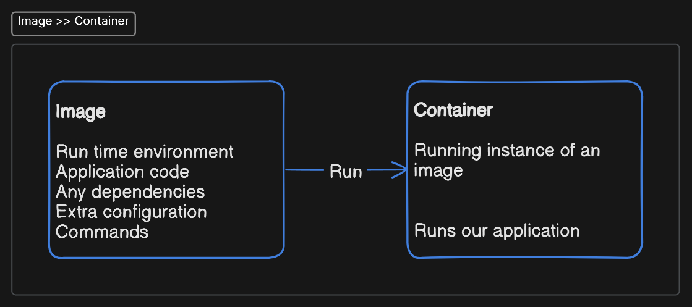
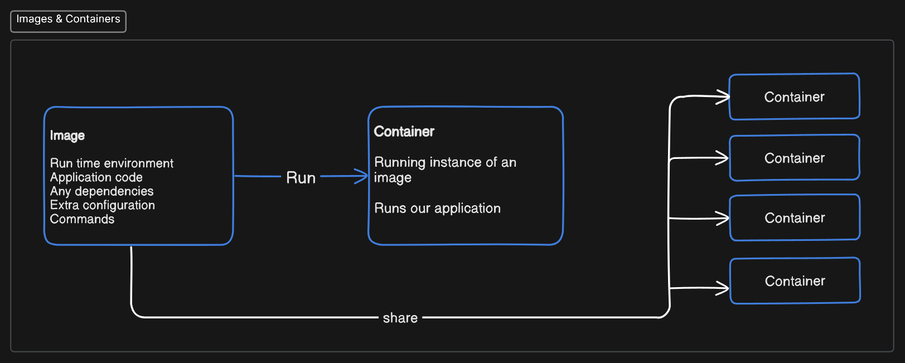
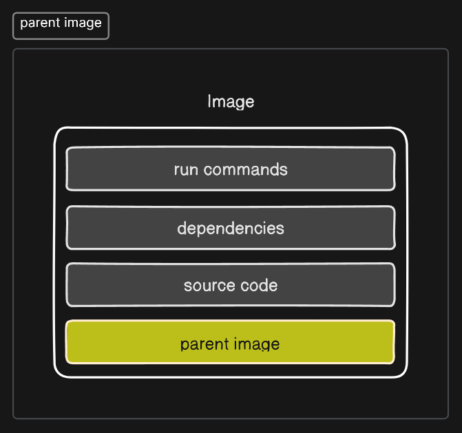

# Docker Crash Course

## What is a container?

A container is an isolated environment for your code. It does not know your operating system or your files. It runs on the environment provided to you by Docker Desktop. Containers have everything your code needs to run, down to a base operating system.

> Containers make applications portable, allowing the same code to run on any device. This makes it easier for developers and IT professionals to deploy applications across environments.

## What is Docker?

Docker is an open-source containerization platform. It enables developers to package applications into containers – standalone, executable packages of software that include everything needed to run an application: code, runtime, system tools, system libraries, and settings.

Docker containers isolate software from its surroundings, for example, differences between development and staging environments, and help reduce conflicts between teams running different software on the same infrastructure.

It can be run on any computing environment, from a developer's laptop to a virtual machine or the cloud. This makes it easy to build, ship, and run applications anywhere.

### Benefits of Docker

1. Portability
2. Efficiency
3. Scalability
4. Security

Docker is a popular choice for developing, deploying, and running microservices-based applications. Microservices are small, independent services that communicate with each other through well-defined APIs. Docker containers are a good fit for microservices because they are lightweight, portable, and scalable.

Docker is also a popular choice for continuous integration and continuous delivery (CI/CD) pipelines. CI/CD is a set of practices that automates the building, testing, and deployment of software. Docker containers can be used to create consistent development, testing, and production environments, which makes it easier to deploy software quickly and reliably.

## Images & Containers

### Images

- Images are like _blueprints_ for containers
- The images contain the following information:
  - Runtime environment
  - Application code
  - Any dependencies
  - Extra configuration (e.g. env variables)
  - Commands
- Images also have a file system of their own which is independent from the rest of your computer
- Images are _read-only_ — once you’ve created an image it cannot be changed
- _If you have made any changes then you need to create a brand-new image to incorporate that change_

### Containers

- Containers are _runnable instances of images_
- It is a process that can run our application exactly as outlined in the image




### Parent Image

- Images are made up of several _layers_
- The parent images serve as the base which is a _premade_
  - This includes the OS & sometimes the runtime environment



## Dockerfile

```docker
FROM     # to pull the image
WORKDIR  # to explicitly specify the working directory
COPY     # to copy the source files from source directory to destination directory
RUN      # to specify the commands that runs at the build time, while building the image
EXPOSE   # to specify the ports
CMD      # to specify the commands that run inside the container
```

## Important Commands

```bash
# To build the image --> docker build -t tag-name relative/path/to/Dockerfile
$ docker build -t myapp .
```
